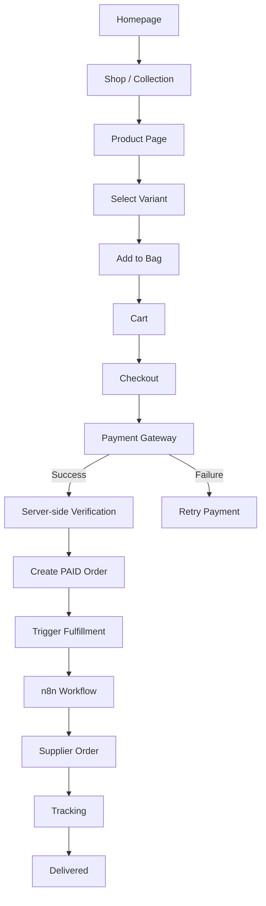
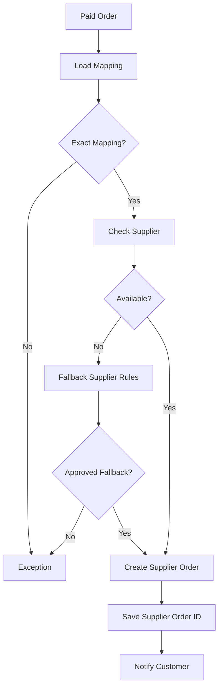

# User Journey & Flowcharts

## 1. Discovery

Landing → Shop/Collection → Search/Filter → Product → Variant → Add to Bag → Cart

## 2. Checkout

Cart → Checkout → Customer details → Shipping details → Payment → Server verification → Paid order → Confirmation

## 3. Fulfillment

Paid order → Fulfillment task → n8n webhook → Load order → Load supplier mapping → Validate → Supplier availability → Place supplier order → Save supplier reference → Update status → Email customer

## 4. Exception

Agent failure → Admin exception queue → Review → Retry / change mapping / contact customer / refund / cancel → Resume or close

## 5. Mermaid

